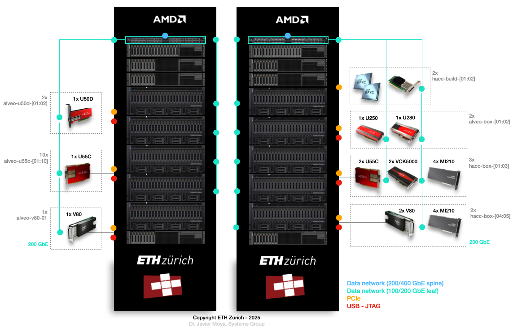

<article class="markdown-body entry-content p-3 p-md-6" itemprop="text">

<a href="https://github.com/fpgasystems/hacc/blob/main/README.md">Back</a>

# Infrastructure
FSG HACC is comprised of AMD high-​end servers, Xilinx accelerator cards, and high-​speed networking. Each accelerator card has all of its QSFP28 interfaces connected to a 100 GbE TOR switch to allow exploration of arbitrary network topologies for distributed computing.

*FSG HACC is comprised of AMD high-​end servers, Xilinx accelerator cards, and high-​speed networking.*

Additionally, we are offering a build server with development and bitstream compilation purposes.

## Inventory
The following table gives an overview of FSG’s HACC resources: 

<table>
<thead>
  <tr>
    <th rowspan="2">Cluster</th>
    <th colspan="4">High-end servers</th>
    <th colspan="3">Xilinx accelerator card</th>
    <th colspan="6">FPGA</th>
  </tr>
  <tr>
    <th>Family</th>
    <th>Memory</th>
    <th>CPU</th>
    <th>SSD</th>
    <th>Family</th>
    <th>DDR</th>
    <th>FPGA</th>
    <th>LUTs</th>
    <th>Registers</th>
    <th>DSPs</th>
    <th>DRAM</th>
    <th>BRAM</th>
    <th>HBM</th>
  </tr>
</thead>
<tbody>
  <tr>
    <td>Build</td>
    <td></td>
    <td></td>
    <td></td>
    <td></td>
    <td></td>
    <td></td>
    <td></td>
    <td></td>
    <td></td>
    <td></td>
    <td></td>
    <td></td>
    <td></td>
  </tr>
  <tr>
    <td>U250</td>
    <td></td>
    <td>xx</td>
    <td>x</td>
    <td></td>
    <td>Alveo U250</td>
    <td></td>
    <td></td>
    <td></td>
    <td></td>
    <td></td>
    <td></td>
    <td></td>
    <td></td>
  </tr>
  <tr>
    <td>U280</td>
    <td></td>
    <td>xx</td>
    <td>x</td>
    <td></td>
    <td>Alveo U280</td>
    <td></td>
    <td></td>
    <td></td>
    <td></td>
    <td></td>
    <td></td>
    <td></td>
    <td></td>
  </tr>
  <tr>
    <td>U50D</td>
    <td></td>
    <td>xx</td>
    <td>x</td>
    <td></td>
    <td>Alveo U50D</td>
    <td></td>
    <td></td>
    <td></td>
    <td></td>
    <td></td>
    <td></td>
    <td></td>
    <td></td>
  </tr>
  <tr>
    <td>U55C</td>
    <td>xx</td>
    <td></td>
    <td></td>
    <td></td>
    <td>Alveo U55C</td>
    <td></td>
    <td></td>
    <td></td>
    <td></td>
    <td></td>
    <td></td>
    <td></td>
    <td></td>
  </tr>
  <tr>
    <td>Versal</td>
    <td></td>
    <td></td>
    <td></td>
    <td></td>
    <td>Versal VCK5000</td>
    <td></td>
    <td></td>
    <td></td>
    <td></td>
    <td></td>
    <td></td>
    <td></td>
    <td></td>
  </tr>
</tbody>
</table>

Remember that each high-end server exposes **only one Xilinx accelerator card to the user.**

## AMD high-end servers

### El model

## Xilinx accelerator cards

### U50D 

### U55C 

### U250

### U280

## Networking

## Limitations

* Els servidors son virtualitzats
* Els servidors comparteixen XXX
* Els servidors XXXX no tenen JTAG
